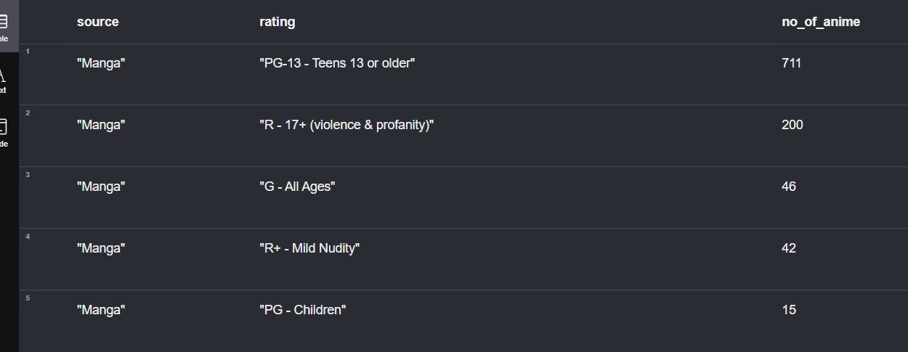
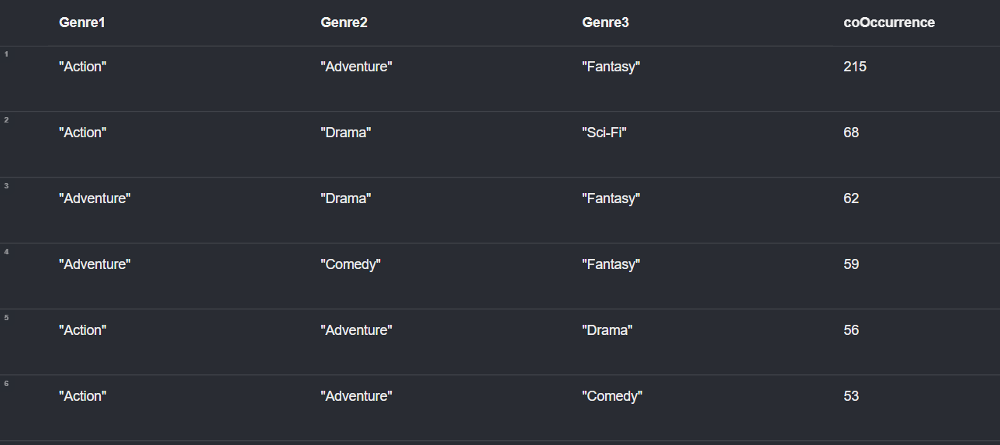
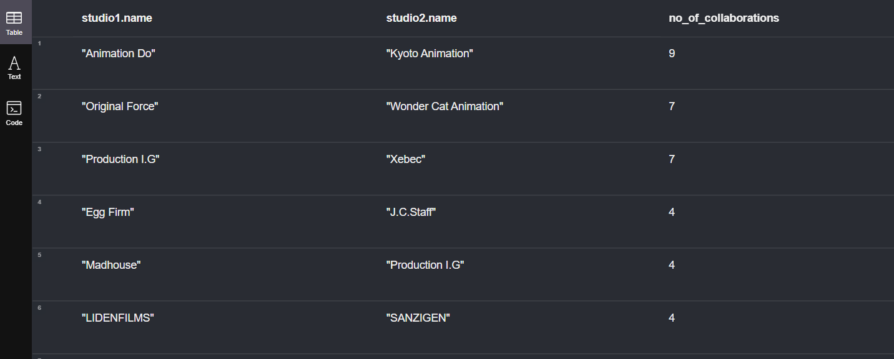
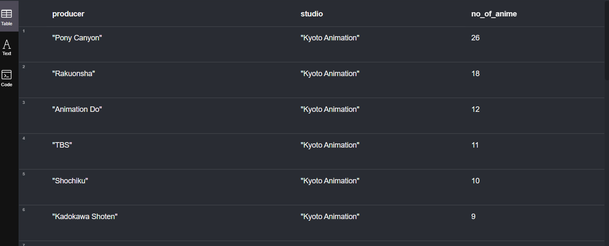

## Setting up Neo4j
- Run [create_tables.cypher](./cipher_queries/create_tables.cypher)

### 1. For a Manga source, what is the usual rating for it? [(File)](./cipher_queries/top_sources.cypher)
    ```cypher
    MATCH (s:Source)<-[rel:HAS_SOURCE]-(a:Anime)-[rel2:HAS_RATING]->(r:Rating)
    WHERE s.name = "Manga"
    RETURN s.name AS source, r.name AS rating, COUNT(DISTINCT a.anime_id) AS no_of_anime
    ORDER BY no_of_anime DESC
    ``` 

- The highest rating is PG-13 with 711 animes, followed by R-17+, G, R+ and PG - Childer.
---

### 2. What genres usually comes together?? [(File)](./cipher_queries/top_genres.cypher)
    ```cypher
    MATCH (a:Anime)-[:HAS_GENRE]->(g1:Genre),
        (a)-[:HAS_GENRE]->(g2:Genre),
        (a)-[:HAS_GENRE]->(g3:Genre)
    WHERE g1 <> g2 AND g2 <> g3 AND g1 <> g3 
    AND g1.name < g2.name AND g2.name < g3.name
    RETURN g1.name AS Genre1, g2.name AS Genre2, g3.name AS Genre3, 
        COUNT(DISTINCT a.anime_id) AS coOccurrence
    ORDER BY coOccurrence DESC
    ```

- It looks like Action, Adventure and Fantasy usually comes together for a certain anime.
---

### 3. Does studios collaborate with each other? [(File)](./cipher_queries/collaboration_between_studios.cypher)
    ```cypher
    MATCH (studio1:Studio)<-[rel:PRODUCED_BY_STUDIO]-(anime:Anime)-[rel2:PRODUCED_BY_STUDIO]->(studio2:Studio)
    WHERE studio1.name < studio2.name // to avoid duplicates
    RETURN studio1.name, studio2.name, COUNT(DISTINCT anime.anime_id) AS no_of_collaborations
    ORDER BY no_of_collaborations DESC
    ```

- The studios that collaborated with each other the most is between Animation Do and Kyoto Animation
---

### 4. What is the producers that `Kyoto Animation` worked with before but not `Animation Do` [(File)](./cipher_queries/collaboration_between_studios_producers.cypher)
    ```cypher
    MATCH (p:Producer)<-[rel:PRODUCED_BY]-(anime:Anime)-[rel2:PRODUCED_BY_STUDIO]->(s:Studio{name:'Kyoto Animation'})
    WHERE NOT EXISTS
    {
        MATCH (p)<-[:PRODUCED_BY]-(anime2:Anime)-[:PRODUCED_BY_STUDIO]->(:Studio {name:'Animation Do'}) 
    }
    RETURN p.name as producer, s.name as studio, COUNT(DISTINCT anime.anime_id) AS no_of_anime
    ORDER BY no_of_anime DESC
    ```

- Pony Canyon is the top producer that Kyoto Animation collaborated with but not even once with Animation Do